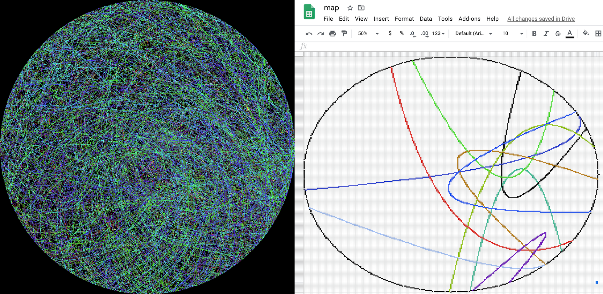

# harry-plotter



Plot points on various surfaces. To start with Google Sheets and JIMP.

## Installation

`npm install harry-plotter`

## Usage

```
var hp = require("harry-plotter");
```

### Google Sheets

To work with Google Sheets you need to provide:

* The credentials from the Service Account you are using
* The ID of the spreadsheet
* The size of the image

```
var creds = {
  "type": "service_account",
  "project_id": "your-project-id",
  "private_key_id": "your-private-key-id",
  "private_key": "ypur-private-key",
  "client_email": "your-client-email",
  "client_id": "your-client-id",
  "auth_uri": "https://accounts.google.com/o/oauth2/auth",
  "token_uri": "https://oauth2.googleapis.com/token",
  "auth_provider_x509_cert_url": "https://www.googleapis.com/oauth2/v1/certs",
  "client_x509_cert_url": "your-client-x509-cert-url"
}

var plotter = new hp.GSheetPlotter('your-sheet-id', creds, 255);
```

See `gheet-demo.js` for a full example.

### JIMP

To work with JIMP you need to provide:

* The name of the image file you want to write to
* The size of the image

```
plotter = new hp.JimpPlotter("demo.png");
```

See `jimp-demo.js` for a full example.

### Both

Init the plotter. This is asyncronous:

```
plotter.init()
``` 

Plot a set of points with:
```
var colours = {red: rgb[0], green: rgb[1], blue: rgb[2]} 
var points = [{x:1, y:2}, {x:100, y:20}, {x:15, y: 0}]
plotter.plot_points(points, colours)
```

Write the results to the surface with:

```
plotter.write
```

## Tests

Tests are run with `jest`